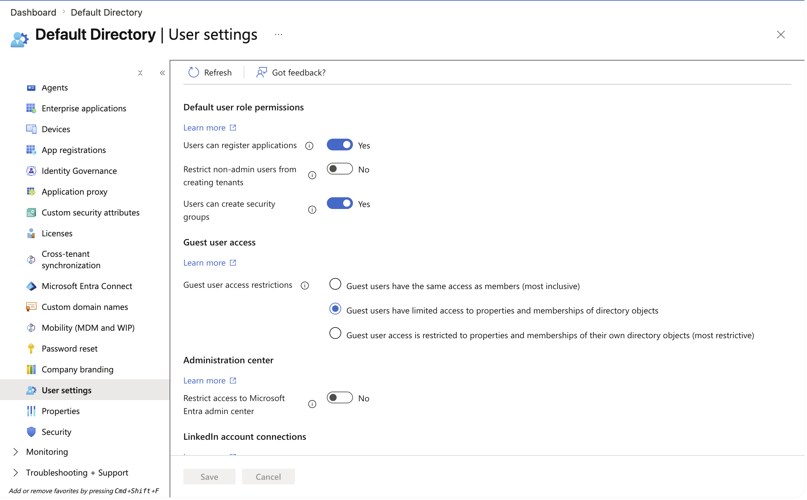

# Entra ID Security Review Lab: Charity Engagement Rehearsal

A hands-on rehearsal of an end-to-end identity security review for a small nonprofit, built in Microsoft Entra ID. I stood up a mock charity tenant, configured it the way an under-resourced nonprofit would, then reviewed it blind against a fixed checklist and produced a prioritised plain-English findings report.

This is a training exercise. No real organisation, data, or systems were involved. The purpose was to rehearse the full client engagement flow before running it for a real charity.

## Why this exists

Small UK charities are expected by the Charity Commission and NCSC to have basic identity controls (MFA, least-privilege admin access, an incident plan) but rarely have anyone with security experience to set them up. This lab rehearses the exact review a volunteer detection engineer would run for such an organisation, covering both the technical review and the client-facing delivery.

## Environment

| Item | Value |
| --- | --- |
| Platform | Microsoft Entra ID |
| License tier | Microsoft Entra ID Free |
| Mock organisation | Riverside Community Trust (fictional) |
| Users | 7 (6 staff personas + 1 tenant owner) |
| Groups / Devices / Apps | 0 / 0 / 0 |
| Tenant region | United States |

## Method

I ran the engagement in two roles.

As the charity, I built a functional but loosely configured tenant: created staff accounts, assigned admin roles liberally, and left baseline settings at their defaults. I recorded each deliberate weakness in a private answer key.

As the analyst, I then reviewed the tenant blind against a fixed checklist, screenshotting each finding, and wrote up the results as a prioritised report. Finally I compared my findings against the answer key to measure what I caught.

## Review checklist

1. Overview counts (users, groups, devices, applications) and license tier
2. Built-in Recommendations tab
3. Global administrator count via Roles and administrators
4. User settings: default user role permissions and guest access
5. External identities / guest configuration
6. Password reset and password protection settings
7. Security defaults / MFA enforcement and authentication methods
8. App registrations and their permissions
9. Sign-in logs (noted as the place to inspect login behaviour on a live tenant)

## Key findings

### 1. Default users hold excessive permissions (Priority: High)

Three default user role permissions were left open:

- Users can register applications: **Yes**
- Restrict non-admin users from creating tenants: **No**
- Users can create security groups: **Yes**

Why it matters: any ordinary staff member can register applications that request access to organisational data, create entirely new tenants, and create security groups. Attackers routinely abuse app registration to establish persistence via consent, and unrestricted tenant creation makes shadow IT invisible to the organisation.

Recommendation: set application registration to No, restrict non-admin tenant creation to Yes, and limit group creation to designated staff.

Note: this finding is easy to miss. An empty app registrations list only means no apps exist yet, not that users are prevented from creating them. The permission toggle and the object list are two different checks.

### 2. Excessive global administrators (Priority: Medium)

Three accounts held the Global Administrator role in a seven-person organisation, including the tenant owner's everyday account. Microsoft's own Recommendations tab independently flagged least-privileged role usage.

Why it matters: every global admin account is a full master key. The more that exist, the larger the attack surface, and mixing admin rights into a daily-use account means one phished login compromises everything.

Recommendation: reduce to one or two global admins and separate administrative access from everyday accounts.

### 3. Passwords set never to expire (Priority: High per Microsoft)

The tenant's built-in Recommendations flagged "Do not expire passwords" as a High priority item, alongside Medium items on unreliable application consent and password hash sync.

Why it matters: this is worth understanding rather than blindly actioning. Modern NCSC and Microsoft guidance actually favours non-expiring passwords combined with MFA and breach detection over forced rotation, which drives weaker password choices. The right response is to confirm MFA coverage rather than reinstate expiry.

Recommendation: verify MFA is enforced for all accounts, then document the non-expiry decision as deliberate rather than accidental.

### 4. Weak password protection baseline (Priority: Medium)

Smart lockout threshold sits at 10 attempts with a 60 second duration. The custom banned password list is not enforced. Advanced password protection features are gated behind Entra ID Premium.

Why it matters: a threshold of 10 gives an attacker meaningful room for password spraying before lockout, and no custom banned list means organisation-specific weak passwords (the charity's own name, for example) remain usable.

Recommendation: lower the lockout threshold, and enable a custom banned password list containing organisation-specific terms.

### 5. MFA enforced via Microsoft-managed security defaults (Positive, with caveats)

MFA is being enforced through Microsoft's automatic managed security defaults rather than a deliberately configured policy. Authentication methods available to all users include Microsoft Authenticator, Passkey (FIDO2), Temporary Access Pass, Software OATH tokens, and Email OTP. SMS and Voice call are disabled.

Why it matters: this is a good baseline and the tenant is protected, but the organisation did not configure it and may be unaware it is active. On the Free tier there is no Conditional Access, so this automatic baseline is the primary line of defence and cannot be finely tuned. SMS being off is a genuine positive, since SMS is the weakest MFA factor.

Recommendation: confirm security defaults are enforcing for all users including admins, document that MFA is active, and understand the tuning limits of the Free tier.

### 6. No group-based access control (Priority: Low)

Zero groups exist, so all access is managed per user.

Why it matters: per-user access does not scale and makes access reviews and revocation inconsistent. Group-based assignment is the foundation of manageable least privilege.

### 7. Checked and clear

Devices (0, with no stale, noncompliant, or unmanaged devices), app registrations (none owned), and external guest identities (not configured) were all absent. Guest access was already set to the middle restriction tier rather than the most permissive, which is a reasonable default.

Recorded with a note on what to watch for on a live tenant: stale guest accounts, over-permissioned app registrations, and unmanaged devices.

## Rehearsal outcome vs answer key

| Planted weakness | Result |
| --- | --- |
| Two extra global admins | Caught. Identified all three including the owner account. |
| MFA not enforced | Reported accurately as actually enforced via Microsoft-managed defaults, rather than assuming the planted state held. |
| Weak passwords | Partially caught. Password protection baseline reviewed; per-user password strength not individually audited. |

Findings found beyond the answer key: excessive default user permissions, password expiry policy, smart lockout threshold, and missing custom banned password list. Several came from the built-in Recommendations tab, which is a fast source of real signal on any live tenant.

Lessons that transfer to a real engagement:

1. Report the tenant as it actually is, not as expected. The intended "no MFA" gap did not hold because Microsoft's automatic baseline was active, and reporting that truthfully matters more than confirming a hypothesis.
2. Distinguish the object list from the permission. "No apps registered" and "users may register apps" are different findings, and only one of them is a risk.
3. Read Microsoft's own recommendations critically. The High priority "do not expire passwords" item runs counter to current NCSC guidance, so the analyst's job is to interpret, not just relay.

## Client engagement flow rehearsed

Beyond the technical review, this lab rehearsed the full soft-skill arc a real charity engagement requires:

- Scoping the work in writing before any access
- Offering two safe access methods (screen-share or read-only account) and declining shared passwords
- Narrating each check in plain English to build trust
- Delivering findings that lead with a positive, prioritise fixes, and stay jargon-free

## What I would do differently on a live tenant

- Inspect Sign-in logs for risky sign-ins, failures, and impossible-travel patterns
- Run NCSC Mail Check and Web Check against the real domain for email and web exposure
- Confirm the tenant region matches the organisation's actual jurisdiction (this lab tenant is set to United States)
- Check whether the free Microsoft 365 Business Premium nonprofit grant applies, which would unlock Conditional Access and advanced password protection

## Skills demonstrated

Identity security review, Entra ID administration, least-privilege analysis, MFA and authentication method assessment, security baseline evaluation against licensing constraints, plain-English risk communication, and structured client engagement from scoping to delivery.

---

Training lab by William Gokah. Detection engineering and security monitoring portfolio.
